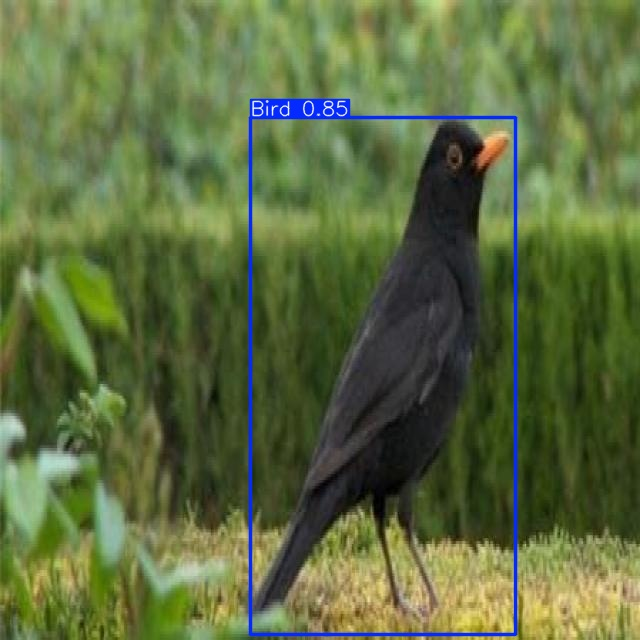

# 🐦 Bird Detection and Tracking with YOLOv11 + Deep SORT

This project detects and tracks birds in **images** and **videos** using YOLOv11 and Deep SORT. It includes an interactive web demo deployed with Gradio on Hugging Face Spaces.

## 🚀 Live Demo

👉 [Launch on Hugging Face Spaces](https://huggingface.co/spaces/TinsaeA/bird-detection-and-tracking)

## 🎯 Features

- 🔍 Real-time bird detection using YOLOv11
- 🧠 Consistent identity tracking with Deep SORT
- 🖼️ Image input with instant visual output (bounding boxes)
- 🎥 Video input with frame-by-frame tracking and ID labels
- 📝 Movement log (entry time + direction) saved as CSV
- 🌐 Deployed web interface using Gradio

## 🖼️ Sample Outputs

### Image Detection  


### Video Tracking  
📽️ [Watch Sample Video Output](https://user-images.githubusercontent.com/your/video.mp4)

## 🛠️ Tech Stack

- `YOLOv11` – object detection
- `Deep SORT` – object tracking
- `Gradio` – user interface
- `Hugging Face Spaces` – deployment
- `OpenCV`, `Matplotlib`, `Pandas` – support libraries

## 📦 How to Run Locally

```bash
git clone https://github.com/YOUR_USERNAME/bird-detection-and-tracking.git
cd bird-detection-and-tracking
pip install -r requirements.txt
python app.py
